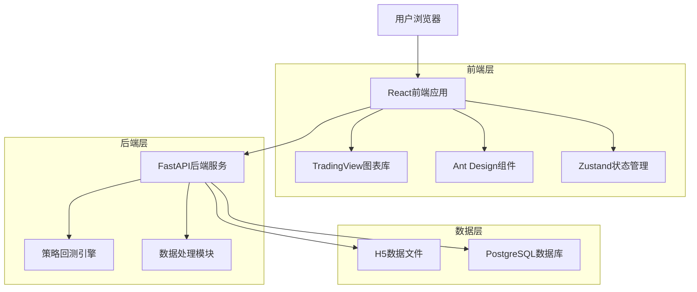
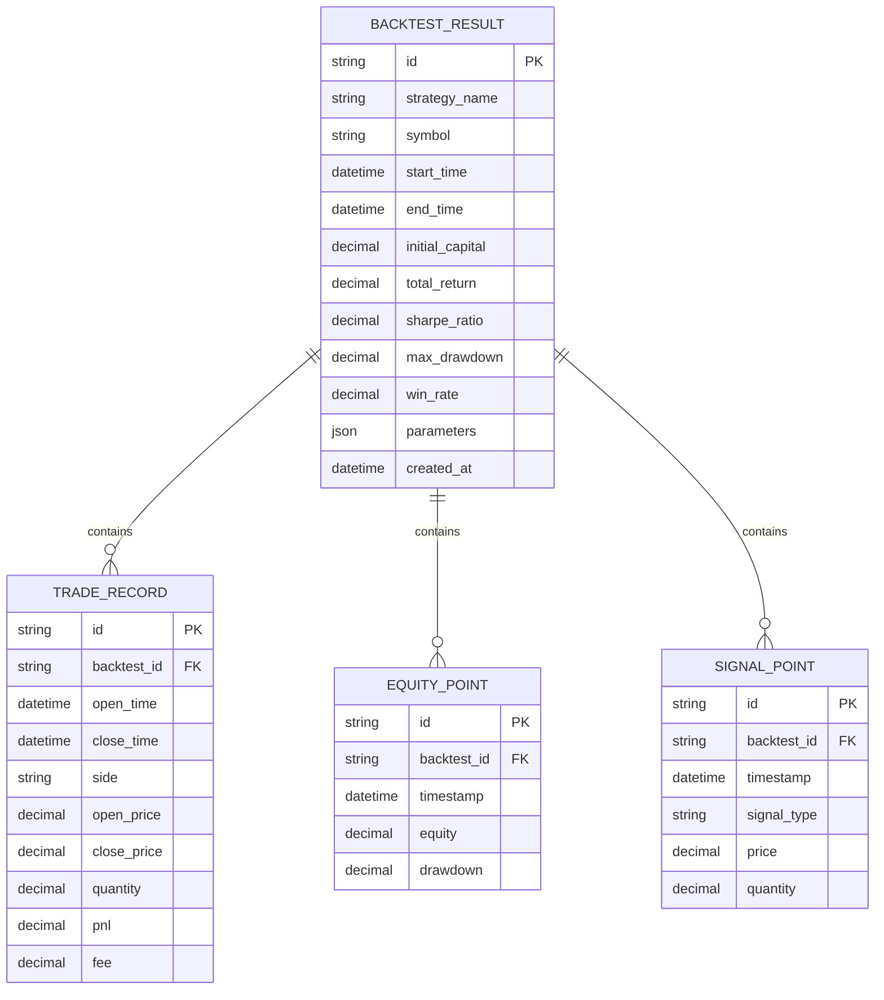

# 前端重构技术架构文档

## 1. 架构设计



## 2. 技术描述

* **前端**: React\@18 + TypeScript + Vite + Ant Design + TradingView Charting Library

* **状态管理**: Zustand

* **HTTP客户端**: Axios

* **图表库**: TradingView Charting Library (专业K线图)

* **样式**: Tailwind CSS + Ant Design

* **后端**: FastAPI (已存在)

## 3. 路由定义

| 路由 | 用途 |
|------|------|
| / | K线图表页面，显示历史数据和策略回测功能 |
| /backtest-result/:taskId | 回测结果页面，显示特定回测的详细结果 |

## 4. API定义

### 4.1 核心API

**获取K线数据**

```
GET /api/kline/data
```

请求参数:

| 参数名         | 参数类型    | 是否必需  | 描述               |
| ----------- | ------- | ----- | ---------------- |
| symbol      | string  | true  | 交易对符号，如ETHUSDT   |
| interval    | string  | true  | 时间间隔，如1m, 5m, 1h |
| start\_time | string  | false | 开始时间，ISO格式       |
| end\_time   | string  | false | 结束时间，ISO格式       |
| limit       | integer | false | 返回数据条数，默认1000    |

响应:

| 参数名   | 参数类型    | 描述     |
| ----- | ------- | ------ |
| data  | array   | K线数据数组 |
| total | integer | 总数据条数  |

**策略回测**

```
POST /api/strategy/backtest
```

请求参数:

| 参数名 | 参数类型 | 是否必需 | 描述 |
|--------|----------|----------|------|
| strategy_config | object | true | 策略配置对象 |
| data_source | string | false | 数据源类型，默认h5 |
| symbol | string | false | 交易对符号，默认ETHUSDT |
| timeframe | string | false | 时间周期，默认1m |

策略配置对象(strategy_config):
| 参数名 | 参数类型 | 是否必需 | 描述 |
|--------|----------|----------|------|
| name | string | true | 策略名称 |
| description | string | true | 策略描述 |
| strategy_type | string | false | 策略类型，默认atr_hedge_grid |
| enable_volatility_adaptive | boolean | false | 启用波动率自适应，默认true |
| atr_period | integer | false | ATR计算周期（分钟），默认720 |
| high_volatility_threshold | number | false | 高波动率阈值，默认0.3 |
| extreme_volatility_threshold | number | false | 极端波动率阈值，默认0.5 |
| leverage | integer | false | 杠杆倍数，默认125 |
| spread | number | false | 价差，默认0.004 |
| position_size_ratio | number | false | 仓位比例，默认1.0 |
| hedge_mode | boolean | false | 对冲模式，默认true |
| enable_position_balance | boolean | false | 启用仓位平衡，默认true |
| enable_emergency_close | boolean | false | 启用紧急平仓，默认false |
| emergency_close_threshold | number | false | 紧急平仓阈值，默认0.2 |
| initial_balance | number | false | 初始资金，默认1000 |
| start_date | string | false | 开始日期，默认2020-01-01 |
| end_date | string | false | 结束日期，默认2020-05-20 |

响应:

| 参数名          | 参数类型   | 描述     |
| ------------ | ------ | ------ |
| backtest\_id | string | 回测任务ID |
| status       | string | 回测状态   |

**获取策略模板**
```
GET /api/strategy/templates
```

响应:
| 参数名 | 参数类型 | 描述 |
|--------|----------|------|
| templates | object | 策略模板对象 |
| total | integer | 模板总数 |

**验证策略配置**
```
POST /api/strategy/validate
```

请求参数:
| 参数名 | 参数类型 | 是否必需 | 描述 |
|--------|----------|----------|------|
| (StrategyConfig) | object | true | 策略配置对象 |

响应:
| 参数名 | 参数类型 | 描述 |
|--------|----------|------|
| is_valid | boolean | 配置是否有效 |
| validation_errors | array | 验证错误列表 |
| warnings | array | 警告信息列表 |
| estimated_memory_usage | number | 预估内存使用量(MB) |
| estimated_runtime | number | 预估运行时间(秒) |

**获取回测结果**

```
GET /api/strategy/backtest/{task_id}
```

响应:

| 参数名 | 参数类型 | 描述 |
|--------|----------|------|
| task_id | string | 回测任务ID |
| status | string | 回测状态(running/completed/failed) |
| start_time | string | 开始时间 |
| end_time | string | 结束时间 |
| total_return | number | 总收益率 |
| sharpe_ratio | number | 夏普比率 |
| max_drawdown | number | 最大回撤 |
| win_rate | number | 胜率 |
| total_trades | integer | 总交易次数 |
| equity_curve | array | 资金曲线数据 |
| trade_history | array | 交易历史记录 |
| performance_metrics | object | 性能指标 |
| error_message | string | 错误信息 |

## 5. 数据模型

### 5.1 数据模型定义



### 5.2 前端数据类型定义

```typescript
// K线数据类型
interface KlineData {
  timestamp: number;
  open: number;
  high: number;
  low: number;
  close: number;
  volume: number;
}

// 策略配置类型
interface StrategyConfig {
  name: string;
  description: string;
  strategy_type?: string;
  // ATR配置
  enable_volatility_adaptive?: boolean;
  atr_period?: number;
  high_volatility_threshold?: number;
  extreme_volatility_threshold?: number;
  // 策略参数
  leverage?: number;
  spread?: number;
  position_size_ratio?: number;
  hedge_mode?: boolean;
  // 风险控制
  enable_position_balance?: boolean;
  enable_emergency_close?: boolean;
  emergency_close_threshold?: number;
  // 回测参数
  initial_balance?: number;
  start_date?: string;
  end_date?: string;
}

// 回测请求类型
interface BacktestRequest {
  strategy_config: StrategyConfig;
  data_source?: string;
  symbol?: string;
  timeframe?: string;
}

// 回测结果类型
interface BacktestResult {
  task_id: string;
  status: 'running' | 'completed' | 'failed';
  start_time: string;
  end_time?: string;
  total_return?: number;
  sharpe_ratio?: number;
  max_drawdown?: number;
  win_rate?: number;
  total_trades?: number;
  equity_curve?: EquityPoint[];
  trade_history?: TradeRecord[];
  performance_metrics?: Record<string, any>;
  error_message?: string;
}

// 交易记录类型
interface TradeRecord {
  id?: string;
  open_time: string;
  close_time?: string;
  side: 'long' | 'short';
  open_price: number;
  close_price?: number;
  quantity: number;
  pnl?: number;
  fee?: number;
  status?: 'open' | 'closed';
}

// 资金曲线点类型
interface EquityPoint {
  timestamp: number;
  equity: number;
  drawdown?: number;
}

// 交易信号类型
interface SignalPoint {
  timestamp: number;
  signal_type: 'open_long' | 'open_short' | 'close_long' | 'close_short';
  price: number;
  quantity: number;
}
```

## 6. 组件架构

### 6.1 组件层次结构

```
App
├── Router
│   ├── KlineChartPage
│   │   ├── TradingViewChart
│   │   ├── StrategyPanel
│   │   └── SignalMarkers
│   ├── BacktestResultPage
│   │   ├── ResultSummary
│   │   ├── EquityCurveChart
│   │   ├── TradeHistoryTable
│   │   └── PositionHistoryChart
│   └── BacktestHistoryPage
│       └── BacktestList
└── GlobalComponents
    ├── Header
    ├── Loading
    └── ErrorBoundary
```

### 6.2 状态管理

使用Zustand进行状态管理，主要状态包括：

* `klineStore`: K线数据状态

* `backtestStore`: 回测相关状态

* `uiStore`: UI状态（加载、错误等）

### 6.3 性能优化

* 使用React.memo优化组件渲染

* 虚拟滚动处理大量交易记录

* TradingView图表的懒加载

* API请求防抖和缓存

* 代码分割和路由懒加载

