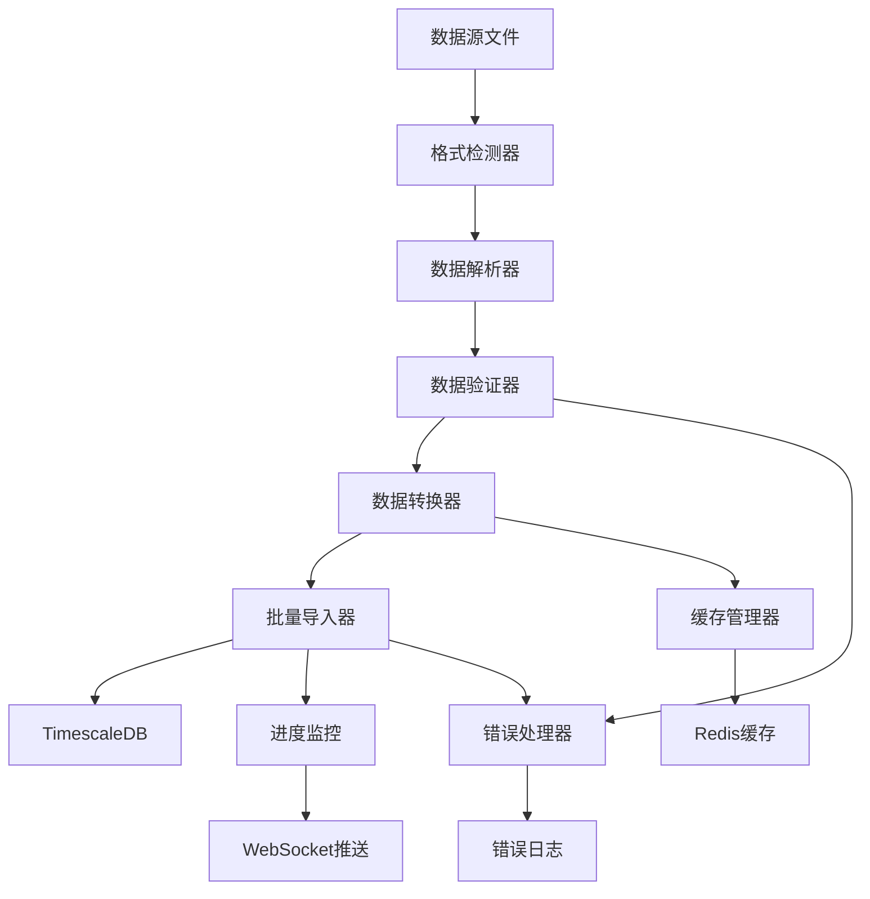

# 数据导入和验证工具设计文档

## 1. 工具概述

### 1.1 设计目标
- **高性能批量导入**: 支持大规模K线数据的高效导入
- **数据完整性验证**: 确保导入数据的准确性和一致性
- **多格式支持**: 支持CSV、JSON、Parquet等多种数据格式
- **增量更新**: 智能识别新数据，避免重复导入
- **错误处理**: 完善的错误检测和恢复机制
- **进度监控**: 实时显示导入进度和状态

### 1.2 技术架构



### 1.3 核心组件
- **DataImporter**: 主导入控制器
- **DataValidator**: 数据验证引擎
- **FormatParser**: 多格式解析器
- **BatchProcessor**: 批量处理器
- **ProgressTracker**: 进度跟踪器
- **ErrorHandler**: 错误处理器

## 2. 数据验证规则

### 2.1 K线数据验证规则

```python
from pydantic import BaseModel, validator, Field
from typing import Optional, List
from datetime import datetime
from decimal import Decimal

class KlineValidationRules(BaseModel):
    """K线数据验证规则"""
    
    # 基础字段验证
    symbol: str = Field(..., min_length=1, max_length=20, description="交易对")
    timeframe: str = Field(..., regex=r'^(1m|5m|15m|30m|1h|4h|1d|1w|1M)$', description="时间框架")
    timestamp: datetime = Field(..., description="时间戳")
    
    # 价格数据验证
    open_price: Decimal = Field(..., gt=0, max_digits=20, decimal_places=8, description="开盘价")
    high_price: Decimal = Field(..., gt=0, max_digits=20, decimal_places=8, description="最高价")
    low_price: Decimal = Field(..., gt=0, max_digits=20, decimal_places=8, description="最低价")
    close_price: Decimal = Field(..., gt=0, max_digits=20, decimal_places=8, description="收盘价")
    
    # 成交量验证
    volume: Decimal = Field(..., ge=0, max_digits=20, decimal_places=8, description="成交量")
    quote_volume: Optional[Decimal] = Field(None, ge=0, max_digits=20, decimal_places=8, description="成交额")
    
    # 交易次数验证
    trade_count: Optional[int] = Field(None, ge=0, description="交易次数")
    
    @validator('high_price')
    def validate_high_price(cls, v, values):
        """验证最高价"""
        if 'open_price' in values and v < values['open_price']:
            raise ValueError('最高价不能低于开盘价')
        if 'low_price' in values and v < values['low_price']:
            raise ValueError('最高价不能低于最低价')
        if 'close_price' in values and v < values['close_price']:
            raise ValueError('最高价不能低于收盘价')
        return v
    
    @validator('low_price')
    def validate_low_price(cls, v, values):
        """验证最低价"""
        if 'open_price' in values and v > values['open_price']:
            raise ValueError('最低价不能高于开盘价')
        if 'close_price' in values and v > values['close_price']:
            raise ValueError('最低价不能高于收盘价')
        return v
    
    @validator('quote_volume')
    def validate_quote_volume(cls, v, values):
        """验证成交额"""
        if v is not None and 'volume' in values and 'close_price' in values:
            expected_quote_volume = values['volume'] * values['close_price']
            tolerance = expected_quote_volume * Decimal('0.01')  # 1%容差
            if abs(v - expected_quote_volume) > tolerance:
                raise ValueError(f'成交额与成交量价格不匹配: 期望{expected_quote_volume}, 实际{v}')
        return v
    
    @validator('timestamp')
    def validate_timestamp(cls, v, values):
        """验证时间戳"""
        if 'timeframe' in values:
            timeframe = values['timeframe']
            # 验证时间戳是否符合时间框架对齐
            if not cls._is_timestamp_aligned(v, timeframe):
                raise ValueError(f'时间戳{v}与时间框架{timeframe}不对齐')
        return v
    
    @staticmethod
    def _is_timestamp_aligned(timestamp: datetime, timeframe: str) -> bool:
        """检查时间戳是否与时间框架对齐"""
        minute = timestamp.minute
        hour = timestamp.hour
        
        if timeframe == '1m':
            return timestamp.second == 0
        elif timeframe == '5m':
            return minute % 5 == 0 and timestamp.second == 0
        elif timeframe == '15m':
            return minute % 15 == 0 and timestamp.second == 0
        elif timeframe == '30m':
            return minute % 30 == 0 and timestamp.second == 0
        elif timeframe == '1h':
            return minute == 0 and timestamp.second == 0
        elif timeframe == '4h':
            return hour % 4 == 0 and minute == 0 and timestamp.second == 0
        elif timeframe == '1d':
            return hour == 0 and minute == 0 and timestamp.second == 0
        
        return True

class DataQualityRules:
    """数据质量验证规则"""
    
    @staticmethod
    def check_data_continuity(kline_data: List[KlineValidationRules]) -> List[str]:
        """检查数据连续性"""
        errors = []
        
        if len(kline_data) < 2:
            return errors
        
        # 按时间排序
        sorted_data = sorted(kline_data, key=lambda x: x.timestamp)
        
        for i in range(1, len(sorted_data)):
            prev_timestamp = sorted_data[i-1].timestamp
            curr_timestamp = sorted_data[i].timestamp
            timeframe = sorted_data[i].timeframe
            
            expected_interval = DataQualityRules._get_timeframe_interval(timeframe)
            actual_interval = (curr_timestamp - prev_timestamp).total_seconds()
            
            if actual_interval != expected_interval:
                errors.append(
                    f"数据不连续: {prev_timestamp} -> {curr_timestamp}, "
                    f"期望间隔{expected_interval}秒, 实际间隔{actual_interval}秒"
                )
        
        return errors
    
    @staticmethod
    def check_price_anomalies(kline_data: List[KlineValidationRules], threshold: float = 0.1) -> List[str]:
        """检查价格异常"""
        errors = []
        
        if len(kline_data) < 2:
            return errors
        
        sorted_data = sorted(kline_data, key=lambda x: x.timestamp)
        
        for i in range(1, len(sorted_data)):
            prev_close = float(sorted_data[i-1].close_price)
            curr_open = float(sorted_data[i].open_price)
            
            # 检查开盘价与前一根K线收盘价的差异
            price_change = abs(curr_open - prev_close) / prev_close
            if price_change > threshold:
                errors.append(
                    f"价格跳跃异常: {sorted_data[i-1].timestamp} 收盘价{prev_close} -> "
                    f"{sorted_data[i].timestamp} 开盘价{curr_open}, 变化幅度{price_change:.2%}"
                )
        
        return errors
    
    @staticmethod
    def check_volume_anomalies(kline_data: List[KlineValidationRules], multiplier: float = 10.0) -> List[str]:
        """检查成交量异常"""
        errors = []
        
        if len(kline_data) < 10:  # 需要足够的数据计算平均值
            return errors
        
        volumes = [float(k.volume) for k in kline_data]
        avg_volume = sum(volumes) / len(volumes)
        
        for i, kline in enumerate(kline_data):
            volume = float(kline.volume)
            if volume > avg_volume * multiplier:
                errors.append(
                    f"成交量异常: {kline.timestamp} 成交量{volume}, "
                    f"平均成交量{avg_volume:.2f}, 倍数{volume/avg_volume:.2f}"
                )
        
        return errors
    
    @staticmethod
    def _get_timeframe_interval(timeframe: str) -> int:
        """获取时间框架对应的秒数间隔"""
        intervals = {
            '1m': 60,
            '5m': 300,
            '15m': 900,
            '30m': 1800,
            '1h': 3600,
            '4h': 14400,
            '1d': 86400,
            '1w': 604800,
            '1M': 2592000  # 近似值
        }
        return intervals.get(timeframe, 60)
```

### 2.2 数据完整性检查

```python
from typing import Dict, List, Tuple, Optional
from datetime import datetime, timedelta
import pandas as pd
from sqlalchemy import text

class DataIntegrityChecker:
    """数据完整性检查器"""
    
    def __init__(self, db_session):
        self.db_session = db_session
    
    async def check_duplicate_data(
        self, 
        symbol: str, 
        timeframe: str, 
        start_date: datetime, 
        end_date: datetime
    ) -> List[Dict]:
        """检查重复数据"""
        query = text("""
            SELECT timestamp, COUNT(*) as count
            FROM kline_data 
            WHERE symbol = :symbol 
                AND timeframe = :timeframe 
                AND timestamp BETWEEN :start_date AND :end_date
            GROUP BY timestamp 
            HAVING COUNT(*) > 1
            ORDER BY timestamp
        """)
        
        result = await self.db_session.execute(query, {
            'symbol': symbol,
            'timeframe': timeframe,
            'start_date': start_date,
            'end_date': end_date
        })
        
        duplicates = []
        for row in result:
            duplicates.append({
                'timestamp': row.timestamp,
                'count': row.count
            })
        
        return duplicates
    
    async def check_missing_data(
        self, 
        symbol: str, 
        timeframe: str, 
        start_date: datetime, 
        end_date: datetime
    ) -> List[datetime]:
        """检查缺失数据"""
        # 获取现有数据的时间戳
        query = text("""
            SELECT timestamp 
            FROM kline_data 
            WHERE symbol = :symbol 
                AND timeframe = :timeframe 
                AND timestamp BETWEEN :start_date AND :end_date
            ORDER BY timestamp
        """)
        
        result = await self.db_session.execute(query, {
            'symbol': symbol,
            'timeframe': timeframe,
            'start_date': start_date,
            'end_date': end_date
        })
        
        existing_timestamps = {row.timestamp for row in result}
        
        # 生成期望的时间戳序列
        expected_timestamps = self._generate_expected_timestamps(
            start_date, end_date, timeframe
        )
        
        # 找出缺失的时间戳
        missing_timestamps = []
        for expected_ts in expected_timestamps:
            if expected_ts not in existing_timestamps:
                missing_timestamps.append(expected_ts)
        
        return missing_timestamps
    
    async def check_data_gaps(
        self, 
        symbol: str, 
        timeframe: str, 
        max_gap_hours: int = 24
    ) -> List[Dict]:
        """检查数据间隙"""
        query = text("""
            WITH gaps AS (
                SELECT 
                    timestamp,
                    LAG(timestamp) OVER (ORDER BY timestamp) as prev_timestamp,
                    EXTRACT(EPOCH FROM (timestamp - LAG(timestamp) OVER (ORDER BY timestamp))) / 3600 as gap_hours
                FROM kline_data 
                WHERE symbol = :symbol AND timeframe = :timeframe
                ORDER BY timestamp
            )
            SELECT 
                prev_timestamp,
                timestamp,
                gap_hours
            FROM gaps 
            WHERE gap_hours > :max_gap_hours
            ORDER BY prev_timestamp
        """)
        
        result = await self.db_session.execute(query, {
            'symbol': symbol,
            'timeframe': timeframe,
            'max_gap_hours': max_gap_hours
        })
        
        gaps = []
        for row in result:
            gaps.append({
                'start_time': row.prev_timestamp,
                'end_time': row.timestamp,
                'gap_hours': row.gap_hours
            })
        
        return gaps
    
    def _generate_expected_timestamps(
        self, 
        start_date: datetime, 
        end_date: datetime, 
        timeframe: str
    ) -> List[datetime]:
        """生成期望的时间戳序列"""
        interval_map = {
            '1m': timedelta(minutes=1),
            '5m': timedelta(minutes=5),
            '15m': timedelta(minutes=15),
            '30m': timedelta(minutes=30),
            '1h': timedelta(hours=1),
            '4h': timedelta(hours=4),
            '1d': timedelta(days=1)
        }
        
        interval = interval_map.get(timeframe)
        if not interval:
            raise ValueError(f"不支持的时间框架: {timeframe}")
        
        timestamps = []
        current = start_date
        
        while current <= end_date:
            timestamps.append(current)
            current += interval
        
        return timestamps
```

## 3. 数据导入器实现

### 3.1 主导入控制器

```python
from typing import Dict, List, Optional, Callable, Any, Union
from pathlib import Path
import asyncio
import logging
from datetime import datetime
from uuid import uuid4, UUID

from app.core.database import get_db_session
from app.core.redis import get_redis
from app.models.kline import KlineData
from app.schemas.kline import KlineDataCreate
from app.api.v1.websocket import broadcast_system_metrics

class DataImporter:
    """数据导入控制器"""
    
    def __init__(self):
        self.logger = logging.getLogger(__name__)
        self.redis = get_redis()
        self.progress_callbacks: List[Callable] = []
    
    async def import_from_file(
        self,
        file_path: Union[str, Path],
        file_format: str = 'auto',
        batch_size: int = 1000,
        validate_data: bool = True,
        skip_duplicates: bool = True,
        progress_callback: Optional[Callable] = None
    ) -> Dict[str, Any]:
        """从文件导入数据"""
        
        import_id = str(uuid4())
        file_path = Path(file_path)
        
        try:
            # 注册进度回调
            if progress_callback:
                self.progress_callbacks.append(progress_callback)
            
            # 检查文件
            if not file_path.exists():
                raise FileNotFoundError(f"文件不存在: {file_path}")
            
            # 自动检测格式
            if file_format == 'auto':
                file_format = self._detect_file_format(file_path)
            
            self.logger.info(f"开始导入文件: {file_path}, 格式: {file_format}")
            
            # 解析文件
            await self._update_progress(import_id, 0, "正在解析文件...")
            parser = self._get_parser(file_format)
            raw_data = await parser.parse_file(file_path)
            
            total_records = len(raw_data)
            self.logger.info(f"解析完成，共{total_records}条记录")
            
            # 数据验证
            if validate_data:
                await self._update_progress(import_id, 10, "正在验证数据...")
                validated_data, validation_errors = await self._validate_data(raw_data)
                
                if validation_errors:
                    self.logger.warning(f"发现{len(validation_errors)}个验证错误")
                    # 可以选择继续导入有效数据或停止
                    if len(validation_errors) > total_records * 0.1:  # 错误率超过10%
                        raise ValueError(f"数据验证错误过多: {len(validation_errors)}个错误")
            else:
                validated_data = raw_data
            
            # 去重处理
            if skip_duplicates:
                await self._update_progress(import_id, 20, "正在检查重复数据...")
                validated_data = await self._remove_duplicates(validated_data)
            
            # 批量导入
            await self._update_progress(import_id, 30, "正在导入数据...")
            import_result = await self._batch_import(
                validated_data, 
                batch_size, 
                import_id
            )
            
            # 更新缓存
            await self._update_progress(import_id, 90, "正在更新缓存...")
            await self._update_cache_after_import(validated_data)
            
            await self._update_progress(import_id, 100, "导入完成")
            
            result = {
                'import_id': import_id,
                'file_path': str(file_path),
                'total_records': total_records,
                'imported_records': import_result['imported_count'],
                'skipped_records': import_result['skipped_count'],
                'error_records': import_result['error_count'],
                'validation_errors': validation_errors if validate_data else [],
                'import_time': import_result['import_time'],
                'status': 'completed'
            }
            
            self.logger.info(f"导入完成: {result}")
            return result
            
        except Exception as e:
            await self._update_progress(import_id, 0, f"导入失败: {str(e)}")
            self.logger.error(f"导入失败: {e}")
            raise
        
        finally:
            # 清理进度回调
            if progress_callback in self.progress_callbacks:
                self.progress_callbacks.remove(progress_callback)
    
    async def import_from_dataframe(
        self,
        df: pd.DataFrame,
        symbol: str,
        timeframe: str,
        batch_size: int = 1000,
        validate_data: bool = True
    ) -> Dict[str, Any]:
        """从DataFrame导入数据"""
        
        import_id = str(uuid4())
        
        try:
            # 转换DataFrame为KlineDataCreate对象
            kline_data = []
            for _, row in df.iterrows():
                kline_data.append(KlineDataCreate(
                    symbol=symbol,
                    timeframe=timeframe,
                    timestamp=row['timestamp'],
                    open_price=row['open'],
                    high_price=row['high'],
                    low_price=row['low'],
                    close_price=row['close'],
                    volume=row['volume'],
                    quote_volume=row.get('quote_volume'),
                    trade_count=row.get('trade_count')
                ))
            
            # 数据验证
            if validate_data:
                validated_data, validation_errors = await self._validate_data(kline_data)
            else:
                validated_data = kline_data
                validation_errors = []
            
            # 批量导入
            import_result = await self._batch_import(validated_data, batch_size, import_id)
            
            return {
                'import_id': import_id,
                'total_records': len(kline_data),
                'imported_records': import_result['imported_count'],
                'validation_errors': validation_errors,
                'status': 'completed'
            }
            
        except Exception as e:
            self.logger.error(f"DataFrame导入失败: {e}")
            raise
    
    async def _validate_data(
        self, 
        raw_data: List[Dict]
    ) -> Tuple[List[KlineDataCreate], List[str]]:
        """验证数据"""
        validated_data = []
        validation_errors = []
        
        for i, record in enumerate(raw_data):
            try:
                # 使用Pydantic验证
                validated_record = KlineValidationRules(**record)
                validated_data.append(KlineDataCreate(**validated_record.dict()))
            except Exception as e:
                validation_errors.append(f"第{i+1}行: {str(e)}")
        
        # 数据质量检查
        if validated_data:
            quality_errors = DataQualityRules.check_data_continuity(validated_data)
            quality_errors.extend(DataQualityRules.check_price_anomalies(validated_data))
            quality_errors.extend(DataQualityRules.check_volume_anomalies(validated_data))
            validation_errors.extend(quality_errors)
        
        return validated_data, validation_errors
    
    async def _batch_import(
        self, 
        data: List[KlineDataCreate], 
        batch_size: int,
        import_id: str
    ) -> Dict[str, Any]:
        """批量导入数据"""
        start_time = datetime.now()
        imported_count = 0
        skipped_count = 0
        error_count = 0
        
        total_batches = (len(data) + batch_size - 1) // batch_size
        
        async with get_db_session() as session:
            for batch_idx in range(0, len(data), batch_size):
                batch_data = data[batch_idx:batch_idx + batch_size]
                
                try:
                    # 转换为数据库模型
                    db_objects = []
                    for item in batch_data:
                        db_obj = KlineData(**item.dict())
                        db_objects.append(db_obj)
                    
                    # 批量插入
                    session.add_all(db_objects)
                    await session.commit()
                    
                    imported_count += len(batch_data)
                    
                    # 更新进度
                    progress = 30 + (batch_idx // batch_size + 1) / total_batches * 60
                    await self._update_progress(
                        import_id, 
                        int(progress), 
                        f"已导入 {imported_count}/{len(data)} 条记录"
                    )
                    
                except Exception as e:
                    await session.rollback()
                    self.logger.error(f"批次导入失败: {e}")
                    error_count += len(batch_data)
        
        import_time = (datetime.now() - start_time).total_seconds()
        
        return {
            'imported_count': imported_count,
            'skipped_count': skipped_count,
            'error_count': error_count,
            'import_time': import_time
        }
    
    async def _remove_duplicates(
        self, 
        data: List[KlineDataCreate]
    ) -> List[KlineDataCreate]:
        """去除重复数据"""
        unique_data = []
        seen_keys = set()
        
        for item in data:
            # 创建唯一键
            key = f"{item.symbol}_{item.timeframe}_{item.timestamp}"
            if key not in seen_keys:
                seen_keys.add(key)
                unique_data.append(item)
        
        return unique_data
    
    async def _update_cache_after_import(self, data: List[KlineDataCreate]):
        """导入后更新缓存"""
        # 按交易对和时间框架分组
        groups = {}
        for item in data:
            key = f"{item.symbol}_{item.timeframe}"
            if key not in groups:
                groups[key] = []
            groups[key].append(item)
        
        # 更新每个组的缓存
        for key, group_data in groups.items():
            symbol, timeframe = key.split('_', 1)
            
            # 更新最新时间戳缓存
            latest_timestamp = max(item.timestamp for item in group_data)
            cache_key = f"latest_timestamp:{symbol}:{timeframe}"
            await self.redis.set(cache_key, latest_timestamp.isoformat(), ttl=3600)
            
            # 清除相关的查询缓存
            pattern = f"kline_query:{symbol}:{timeframe}:*"
            # 这里可以实现缓存清理逻辑
    
    async def _update_progress(self, import_id: str, progress: int, message: str):
        """更新导入进度"""
        progress_data = {
            'import_id': import_id,
            'progress': progress,
            'message': message,
            'timestamp': datetime.now().isoformat()
        }
        
        # 存储到Redis
        await self.redis.set(
            f"import_progress:{import_id}", 
            progress_data, 
            ttl=3600
        )
        
        # 广播进度更新
        await broadcast_system_metrics({
            'type': 'import_progress',
            'data': progress_data
        })
        
        # 调用注册的回调函数
        for callback in self.progress_callbacks:
            try:
                await callback(progress_data)
            except Exception as e:
                self.logger.error(f"进度回调执行失败: {e}")
    
    def _detect_file_format(self, file_path: Path) -> str:
        """自动检测文件格式"""
        suffix = file_path.suffix.lower()
        
        format_map = {
            '.csv': 'csv',
            '.json': 'json',
            '.parquet': 'parquet',
            '.xlsx': 'excel',
            '.xls': 'excel'
        }
        
        return format_map.get(suffix, 'csv')
    
    def _get_parser(self, file_format: str):
        """获取对应格式的解析器"""
        parsers = {
            'csv': CSVParser(),
            'json': JSONParser(),
            'parquet': ParquetParser(),
            'excel': ExcelParser()
        }
        
        parser = parsers.get(file_format)
        if not parser:
            raise ValueError(f"不支持的文件格式: {file_format}")
        
        return parser
```

### 3.2 文件格式解析器

```python
from abc import ABC, abstractmethod
from typing import List, Dict, Any
from pathlib import Path
import pandas as pd
import json
import asyncio
from concurrent.futures import ThreadPoolExecutor

class BaseParser(ABC):
    """文件解析器基类"""
    
    @abstractmethod
    async def parse_file(self, file_path: Path) -> List[Dict[str, Any]]:
        """解析文件"""
        pass
    
    def _standardize_columns(self, df: pd.DataFrame) -> pd.DataFrame:
        """标准化列名"""
        column_mapping = {
            # 时间相关
            'time': 'timestamp',
            'datetime': 'timestamp',
            'date': 'timestamp',
            'ts': 'timestamp',
            
            # 价格相关
            'o': 'open',
            'h': 'high',
            'l': 'low',
            'c': 'close',
            'open_price': 'open',
            'high_price': 'high',
            'low_price': 'low',
            'close_price': 'close',
            
            # 成交量相关
            'v': 'volume',
            'vol': 'volume',
            'base_volume': 'volume',
            'quote_vol': 'quote_volume',
            'quote_asset_volume': 'quote_volume',
            
            # 其他
            'count': 'trade_count',
            'trades': 'trade_count'
        }
        
        # 重命名列
        df = df.rename(columns=column_mapping)
        
        # 确保必需列存在
        required_columns = ['timestamp', 'open', 'high', 'low', 'close', 'volume']
        missing_columns = [col for col in required_columns if col not in df.columns]
        
        if missing_columns:
            raise ValueError(f"缺少必需列: {missing_columns}")
        
        return df
    
    def _convert_timestamp(self, df: pd.DataFrame) -> pd.DataFrame:
        """转换时间戳格式"""
        if 'timestamp' in df.columns:
            # 尝试多种时间格式
            try:
                df['timestamp'] = pd.to_datetime(df['timestamp'])
            except:
                # 如果是Unix时间戳
                try:
                    df['timestamp'] = pd.to_datetime(df['timestamp'], unit='s')
                except:
                    # 如果是毫秒时间戳
                    try:
                        df['timestamp'] = pd.to_datetime(df['timestamp'], unit='ms')
                    except:
                        raise ValueError("无法解析时间戳格式")
        
        return df

class CSVParser(BaseParser):
    """CSV文件解析器"""
    
    async def parse_file(self, file_path: Path) -> List[Dict[str, Any]]:
        """解析CSV文件"""
        
        def _parse_csv():
            # 尝试不同的分隔符
            separators = [',', ';', '\t']
            
            for sep in separators:
                try:
                    df = pd.read_csv(file_path, sep=sep)
                    if len(df.columns) > 1:  # 成功解析
                        break
                except:
                    continue
            else:
                raise ValueError("无法解析CSV文件")
            
            # 标准化列名和数据
            df = self._standardize_columns(df)
            df = self._convert_timestamp(df)
            
            # 转换为字典列表
            return df.to_dict('records')
        
        # 在线程池中执行文件读取
        loop = asyncio.get_event_loop()
        with ThreadPoolExecutor() as executor:
            result = await loop.run_in_executor(executor, _parse_csv)
        
        return result

class JSONParser(BaseParser):
    """JSON文件解析器"""
    
    async def parse_file(self, file_path: Path) -> List[Dict[str, Any]]:
        """解析JSON文件"""
        
        def _parse_json():
            with open(file_path, 'r', encoding='utf-8') as f:
                data = json.load(f)
            
            # 如果是嵌套结构，尝试提取数据
            if isinstance(data, dict):
                # 查找可能的数据键
                data_keys = ['data', 'klines', 'candles', 'ohlcv']
                for key in data_keys:
                    if key in data and isinstance(data[key], list):
                        data = data[key]
                        break
                else:
                    raise ValueError("无法找到有效的数据数组")
            
            if not isinstance(data, list):
                raise ValueError("JSON数据必须是数组格式")
            
            # 转换为DataFrame进行标准化
            df = pd.DataFrame(data)
            df = self._standardize_columns(df)
            df = self._convert_timestamp(df)
            
            return df.to_dict('records')
        
        loop = asyncio.get_event_loop()
        with ThreadPoolExecutor() as executor:
            result = await loop.run_in_executor(executor, _parse_json)
        
        return result

class ParquetParser(BaseParser):
    """Parquet文件解析器"""
    
    async def parse_file(self, file_path: Path) -> List[Dict[str, Any]]:
        """解析Parquet文件"""
        
        def _parse_parquet():
            df = pd.read_parquet(file_path)
            df = self._standardize_columns(df)
            df = self._convert_timestamp(df)
            return df.to_dict('records')
        
        loop = asyncio.get_event_loop()
        with ThreadPoolExecutor() as executor:
            result = await loop.run_in_executor(executor, _parse_parquet)
        
        return result

class ExcelParser(BaseParser):
    """Excel文件解析器"""
    
    async def parse_file(self, file_path: Path) -> List[Dict[str, Any]]:
        """解析Excel文件"""
        
        def _parse_excel():
            # 读取第一个工作表
            df = pd.read_excel(file_path, sheet_name=0)
            df = self._standardize_columns(df)
            df = self._convert_timestamp(df)
            return df.to_dict('records')
        
        loop = asyncio.get_event_loop()
        with ThreadPoolExecutor() as executor:
            result = await loop.run_in_executor(executor, _parse_excel)
        
        return result
```

## 4. 命令行工具

### 4.1 CLI接口设计

```python
import click
import asyncio
from pathlib import Path
from typing import Optional
from datetime import datetime

from app.core.database import init_db, close_db
from app.utils.data_importer import DataImporter
from app.utils.data_validator import DataIntegrityChecker

@click.group()
def cli():
    """量化交易数据导入工具"""
    pass

@cli.command()
@click.argument('file_path', type=click.Path(exists=True))
@click.option('--format', 'file_format', default='auto', 
              help='文件格式 (auto, csv, json, parquet, excel)')
@click.option('--batch-size', default=1000, help='批量导入大小')
@click.option('--no-validate', is_flag=True, help='跳过数据验证')
@click.option('--allow-duplicates', is_flag=True, help='允许重复数据')
@click.option('--symbol', help='指定交易对（用于无symbol列的文件）')
@click.option('--timeframe', help='指定时间框架（用于无timeframe列的文件）')
def import_data(
    file_path: str,
    file_format: str,
    batch_size: int,
    no_validate: bool,
    allow_duplicates: bool,
    symbol: Optional[str],
    timeframe: Optional[str]
):
    """导入K线数据文件"""
    
    async def _import():
        await init_db()
        try:
            importer = DataImporter()
            
            # 进度回调
            def progress_callback(progress_data):
                click.echo(f"进度: {progress_data['progress']}% - {progress_data['message']}")
            
            result = await importer.import_from_file(
                file_path=Path(file_path),
                file_format=file_format,
                batch_size=batch_size,
                validate_data=not no_validate,
                skip_duplicates=not allow_duplicates,
                progress_callback=progress_callback
            )
            
            click.echo("\n导入完成:")
            click.echo(f"  文件: {result['file_path']}")
            click.echo(f"  总记录数: {result['total_records']}")
            click.echo(f"  成功导入: {result['imported_records']}")
            click.echo(f"  跳过记录: {result['skipped_records']}")
            click.echo(f"  错误记录: {result['error_records']}")
            click.echo(f"  导入耗时: {result['import_time']:.2f}秒")
            
            if result['validation_errors']:
                click.echo(f"\n验证错误 ({len(result['validation_errors'])}个):")
                for error in result['validation_errors'][:10]:  # 只显示前10个错误
                    click.echo(f"  - {error}")
                if len(result['validation_errors']) > 10:
                    click.echo(f"  ... 还有{len(result['validation_errors']) - 10}个错误")
            
        except Exception as e:
            click.echo(f"导入失败: {e}", err=True)
            raise click.Abort()
        finally:
            await close_db()
    
    asyncio.run(_import())

@cli.command()
@click.argument('symbol')
@click.argument('timeframe')
@click.option('--start-date', type=click.DateTime(), help='开始日期')
@click.option('--end-date', type=click.DateTime(), help='结束日期')
def validate_data(symbol: str, timeframe: str, start_date: Optional[datetime], end_date: Optional[datetime]):
    """验证数据完整性"""
    
    async def _validate():
        await init_db()
        try:
            from app.core.database import get_db_session
            
            async with get_db_session() as session:
                checker = DataIntegrityChecker(session)
                
                click.echo(f"正在检查 {symbol} {timeframe} 的数据完整性...")
                
                # 检查重复数据
                if start_date and end_date:
                    duplicates = await checker.check_duplicate_data(
                        symbol, timeframe, start_date, end_date
                    )
                    if duplicates:
                        click.echo(f"\n发现 {len(duplicates)} 个重复时间戳:")
                        for dup in duplicates[:10]:
                            click.echo(f"  {dup['timestamp']}: {dup['count']}条记录")
                    else:
                        click.echo("✓ 无重复数据")
                    
                    # 检查缺失数据
                    missing = await checker.check_missing_data(
                        symbol, timeframe, start_date, end_date
                    )
                    if missing:
                        click.echo(f"\n发现 {len(missing)} 个缺失时间戳:")
                        for ts in missing[:10]:
                            click.echo(f"  {ts}")
                    else:
                        click.echo("✓ 无缺失数据")
                
                # 检查数据间隙
                gaps = await checker.check_data_gaps(symbol, timeframe)
                if gaps:
                    click.echo(f"\n发现 {len(gaps)} 个数据间隙:")
                    for gap in gaps[:10]:
                        click.echo(f"  {gap['start_time']} -> {gap['end_time']} ({gap['gap_hours']:.1f}小时)")
                else:
                    click.echo("✓ 无数据间隙")
                
        except Exception as e:
            click.echo(f"验证失败: {e}", err=True)
            raise click.Abort()
        finally:
            await close_db()
    
    asyncio.run(_validate())

@cli.command()
@click.argument('symbol')
@click.argument('timeframe')
def get_data_info(symbol: str, timeframe: str):
    """获取数据信息"""
    
    async def _get_info():
        await init_db()
        try:
            from app.core.database import get_db_session
            from sqlalchemy import text
            
            async with get_db_session() as session:
                # 获取数据统计
                query = text("""
                    SELECT 
                        COUNT(*) as total_records,
                        MIN(timestamp) as start_time,
                        MAX(timestamp) as end_time,
                        MIN(low_price) as min_price,
                        MAX(high_price) as max_price,
                        SUM(volume) as total_volume
                    FROM kline_data 
                    WHERE symbol = :symbol AND timeframe = :timeframe
                """)
                
                result = await session.execute(query, {
                    'symbol': symbol,
                    'timeframe': timeframe
                })
                
                row = result.first()
                if row and row.total_records > 0:
                    click.echo(f"数据信息 - {symbol} {timeframe}:")
                    click.echo(f"  总记录数: {row.total_records:,}")
                    click.echo(f"  时间范围: {row.start_time} ~ {row.end_time}")
                    click.echo(f"  价格范围: {row.min_price} ~ {row.max_price}")
                    click.echo(f"  总成交量: {row.total_volume:,.2f}")
                    
                    # 计算数据密度
                    time_span = (row.end_time - row.start_time).total_seconds()
                    expected_records = time_span / 60  # 假设1分钟数据
                    if timeframe == '5m':
                        expected_records /= 5
                    elif timeframe == '1h':
                        expected_records /= 60
                    elif timeframe == '1d':
                        expected_records /= 1440
                    
                    if expected_records > 0:
                        density = row.total_records / expected_records * 100
                        click.echo(f"  数据密度: {density:.1f}%")
                else:
                    click.echo(f"未找到 {symbol} {timeframe} 的数据")
                
        except Exception as e:
            click.echo(f"获取信息失败: {e}", err=True)
            raise click.Abort()
        finally:
            await close_db()
    
    asyncio.run(_get_info())

@cli.command()
def list_symbols():
    """列出所有可用的交易对"""
    
    async def _list_symbols():
        await init_db()
        try:
            from app.core.database import get_db_session
            from sqlalchemy import text
            
            async with get_db_session() as session:
                query = text("""
                    SELECT 
                        symbol,
                        timeframe,
                        COUNT(*) as record_count,
                        MIN(timestamp) as start_time,
                        MAX(timestamp) as end_time
                    FROM kline_data 
                    GROUP BY symbol, timeframe
                    ORDER BY symbol, timeframe
                """)
                
                result = await session.execute(query)
                
                click.echo("可用的交易对和时间框架:")
                click.echo(f"{'交易对':<15} {'时间框架':<10} {'记录数':<10} {'开始时间':<20} {'结束时间':<20}")
                click.echo("-" * 80)
                
                for row in result:
                    click.echo(
                        f"{row.symbol:<15} {row.timeframe:<10} {row.record_count:<10,} "
                        f"{row.start_time.strftime('%Y-%m-%d %H:%M'):<20} "
                        f"{row.end_time.strftime('%Y-%m-%d %H:%M'):<20}"
                    )
                
        except Exception as e:
            click.echo(f"获取列表失败: {e}", err=True)
            raise click.Abort()
        finally:
            await close_db()
    
    asyncio.run(_list_symbols())

if __name__ == '__main__':
    cli()
```

### 4.2 使用示例

```bash
# 导入CSV文件
python data_import_cli.py import-data data/BTCUSDT_1h.csv --format csv --batch-size 1000

# 导入JSON文件并跳过验证
python data_import_cli.py import-data data/klines.json --format json --no-validate

# 验证数据完整性
python data_import_cli.py validate-data BTCUSDT 1h --start-date "2023-01-01" --end-date "2023-12-31"

# 获取数据信息
python data_import_cli.py get-data-info BTCUSDT 1h

# 列出所有交易对
python data_import_cli.py list-symbols
```

## 5. Web界面集成

### 5.1 上传API端点

```python
from fastapi import APIRouter, UploadFile, File, Form, HTTPException, BackgroundTasks
from typing import Optional
import tempfile
import os

from app.utils.data_importer import DataImporter
from app.schemas.response import StandardResponse

router = APIRouter()

@router.post("/upload")
async def upload_data_file(
    background_tasks: BackgroundTasks,
    file: UploadFile = File(...),
    file_format: str = Form('auto'),
    batch_size: int = Form(1000),
    validate_data: bool = Form(True),
    skip_duplicates: bool = Form(True),
    symbol: Optional[str] = Form(None),
    timeframe: Optional[str] = Form(None)
):
    """上传并导入数据文件"""
    
    # 验证文件大小
    if file.size > 100 * 1024 * 1024:  # 100MB限制
        raise HTTPException(status_code=413, detail="文件过大，最大支持100MB")
    
    # 验证文件类型
    allowed_extensions = {'.csv', '.json', '.parquet', '.xlsx', '.xls'}
    file_extension = os.path.splitext(file.filename)[1].lower()
    if file_extension not in allowed_extensions:
        raise HTTPException(status_code=400, detail=f"不支持的文件类型: {file_extension}")
    
    # 保存临时文件
    with tempfile.NamedTemporaryFile(delete=False, suffix=file_extension) as temp_file:
        content = await file.read()
        temp_file.write(content)
        temp_file_path = temp_file.name
    
    try:
        # 异步导入
        importer = DataImporter()
        
        # 添加后台任务
        background_tasks.add_task(
            _import_file_task,
            temp_file_path,
            file_format,
            batch_size,
            validate_data,
            skip_duplicates
        )
        
        return StandardResponse(
            success=True,
            data={
                "message": "文件上传成功，正在后台处理",
                "filename": file.filename,
                "file_size": file.size
            }
        )
        
    except Exception as e:
        # 清理临时文件
        if os.path.exists(temp_file_path):
            os.unlink(temp_file_path)
        raise HTTPException(status_code=500, detail=f"导入失败: {str(e)}")

async def _import_file_task(
    file_path: str,
    file_format: str,
    batch_size: int,
    validate_data: bool,
    skip_duplicates: bool
):
    """后台导入任务"""
    try:
        importer = DataImporter()
        result = await importer.import_from_file(
            file_path=file_path,
            file_format=file_format,
            batch_size=batch_size,
            validate_data=validate_data,
            skip_duplicates=skip_duplicates
        )
        
        # 这里可以发送WebSocket通知或邮件通知
        logging.info(f"文件导入完成: {result}")
        
    except Exception as e:
        logging.error(f"后台导入任务失败: {e}")
    finally:
        # 清理临时文件
        if os.path.exists(file_path):
            os.unlink(file_path)
```

通过以上设计，我们构建了一个完整的数据导入和验证工具系统，具备高性能批量导入、全面的数据验证、多格式支持、错误处理和进度监控等功能，为量化交易系统提供了可靠的数据基础设施。