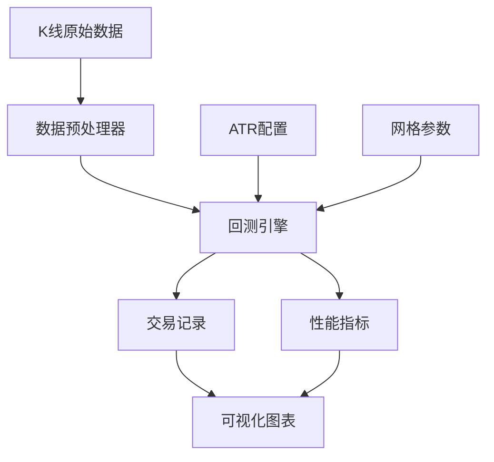

# 对冲网格策略回测系统数据迁移方案

## 1. 项目概述

本文档规划从当前Python单体后端架构迁移到React + FastAPI前后端分离架构的完整方案，重点考虑量化交易数据的特殊性和高频访问需求。

## 2. 现有数据结构分析

### 2.1 核心数据类型

| 数据类型 | 存储位置           | 格式        | 大小估算      | 访问频率 |
| ---- | -------------- | --------- | --------- | ---- |
| K线数据 | `data/` 目录     | CSV文件     | \~100MB/年 | 高频读取 |
| 缓存文件 | `__pycache__/` | .pyc文件    | \~50MB    | 系统级  |
| 回测结果 | 内存/临时文件        | Python对象  | \~10MB/次  | 中频读写 |
| 配置参数 | .py文件          | Python字典  | <1MB      | 低频读取 |
| 交易记录 | 运行时生成          | DataFrame | \~5MB/次   | 高频写入 |

### 2.2 数据依赖关系



### 2.3 数据特殊性分析

* **时序性**: K线数据具有严格的时间顺序，需要保证数据完整性

* **高频性**: 回测过程中需要快速读取大量历史数据

* **精度要求**: 金融数据需要保持高精度，避免浮点误差

* **实时性**: 策略参数调整需要快速响应

## 3. 新架构数据存储设计

### 3.1 数据库选型

**主数据库: PostgreSQL + TimescaleDB**

* 原因: 专为时序数据优化，支持高频插入和查询

* 用途: 存储K线数据、交易记录、回测结果

**缓存层: Redis**

* 原因: 内存数据库，极快的读写速度

* 用途: 缓存热点数据、会话状态、实时计算结果

**文件存储: MinIO (S3兼容)**

* 原因: 对象存储，适合大文件和备份

* 用途: 原始数据备份、图表文件、日志文件

### 3.2 数据表设计

#### 3.2.1 K线数据表 (kline\_data)

```sql
CREATE TABLE kline_data (
    id BIGSERIAL PRIMARY KEY,
    symbol VARCHAR(20) NOT NULL,
    timeframe VARCHAR(10) NOT NULL,
    timestamp TIMESTAMPTZ NOT NULL,
    open DECIMAL(20,8) NOT NULL,
    high DECIMAL(20,8) NOT NULL,
    low DECIMAL(20,8) NOT NULL,
    close DECIMAL(20,8) NOT NULL,
    volume DECIMAL(20,8) NOT NULL,
    created_at TIMESTAMPTZ DEFAULT NOW()
);

-- 创建时序表
SELECT create_hypertable('kline_data', 'timestamp');

-- 创建索引
CREATE INDEX idx_kline_symbol_timeframe_timestamp 
ON kline_data (symbol, timeframe, timestamp DESC);
```

#### 3.2.2 回测结果表 (backtest\_results)

```sql
CREATE TABLE backtest_results (
    id UUID PRIMARY KEY DEFAULT gen_random_uuid(),
    strategy_name VARCHAR(100) NOT NULL,
    parameters JSONB NOT NULL,
    start_date DATE NOT NULL,
    end_date DATE NOT NULL,
    initial_balance DECIMAL(20,8) NOT NULL,
    final_balance DECIMAL(20,8) NOT NULL,
    total_return DECIMAL(10,4) NOT NULL,
    max_drawdown DECIMAL(10,4) NOT NULL,
    sharpe_ratio DECIMAL(10,4),
    total_trades INTEGER NOT NULL,
    win_rate DECIMAL(5,2) NOT NULL,
    is_liquidated BOOLEAN DEFAULT FALSE,
    created_at TIMESTAMPTZ DEFAULT NOW()
);
```

#### 3.2.3 交易记录表 (trade\_records)

```sql
CREATE TABLE trade_records (
    id BIGSERIAL PRIMARY KEY,
    backtest_id UUID REFERENCES backtest_results(id),
    timestamp TIMESTAMPTZ NOT NULL,
    symbol VARCHAR(20) NOT NULL,
    side VARCHAR(10) NOT NULL, -- 'long' or 'short'
    action VARCHAR(10) NOT NULL, -- 'open' or 'close'
    quantity DECIMAL(20,8) NOT NULL,
    price DECIMAL(20,8) NOT NULL,
    fee DECIMAL(20,8) NOT NULL,
    pnl DECIMAL(20,8),
    balance_after DECIMAL(20,8) NOT NULL,
    created_at TIMESTAMPTZ DEFAULT NOW()
);

SELECT create_hypertable('trade_records', 'timestamp');
```

### 3.3 API接口设计

#### 3.3.1 核心API端点

**数据管理API**

```
GET  /api/v1/kline/{symbol}?timeframe=1h&start=2020-01-01&end=2020-12-31
POST /api/v1/kline/upload
GET  /api/v1/symbols
```

**回测API**

```
POST /api/v1/backtest/run
GET  /api/v1/backtest/{id}/status
GET  /api/v1/backtest/{id}/result
GET  /api/v1/backtest/history
```

**实时监控API**

```
GET  /api/v1/backtest/{id}/progress (WebSocket)
GET  /api/v1/backtest/{id}/trades
GET  /api/v1/backtest/{id}/metrics
```

#### 3.3.2 数据传输格式

**K线数据响应**

```json
{
  "success": true,
  "data": {
    "symbol": "ETH-USDC",
    "timeframe": "1h",
    "klines": [
      {
        "timestamp": "2020-01-01T00:00:00Z",
        "open": "129.50",
        "high": "131.20",
        "low": "128.80",
        "close": "130.75",
        "volume": "1250000.00"
      }
    ],
    "total": 8760,
    "page": 1,
    "per_page": 1000
  }
}
```

**回测请求**

```json
{
  "strategy_name": "hedge_grid",
  "symbol": "ETH-USDC",
  "timeframe": "1h",
  "start_date": "2020-01-01",
  "end_date": "2020-12-31",
  "initial_balance": 10000,
  "leverage": 3,
  "parameters": {
    "grid_spacing": 0.005,
    "atr_period": 14,
    "atr_threshold": 0.3,
    "emergency_threshold": 0.5
  }
}
```

## 4. 迁移步骤和时间安排

### 4.1 第一阶段: 基础设施搭建 (1-2周)

**Week 1: 数据库环境**

* [ ] 安装配置PostgreSQL + TimescaleDB

* [ ] 安装配置Redis

* [ ] 设计并创建数据表结构

* [ ] 编写数据库连接和基础CRUD操作

**Week 2: API框架**

* [ ] 搭建FastAPI项目结构

* [ ] 实现数据库ORM模型 (SQLAlchemy)

* [ ] 创建基础API端点

* [ ] 添加API文档和测试

### 4.2 第二阶段: 数据迁移 (2-3周)

**Week 3: 数据导入工具**

* [ ] 开发CSV到数据库的导入脚本

* [ ] 实现数据验证和清洗逻辑

* [ ] 批量导入历史K线数据

* [ ] 验证数据完整性和准确性

**Week 4-5: 核心功能迁移**

* [ ] 迁移ATR计算逻辑到新架构

* [ ] 迁移网格策略核心算法

* [ ] 实现回测引擎API

* [ ] 添加实时进度监控

### 4.3 第三阶段: 前端开发 (2-3周)

**Week 6-7: React前端**

* [ ] 创建React项目结构

* [ ] 实现数据可视化组件 (Chart.js/D3.js)

* [ ] 开发参数配置界面

* [ ] 集成WebSocket实时更新

**Week 8: 集成测试**

* [ ] 端到端功能测试

* [ ] 性能压力测试

* [ ] 用户体验优化

* [ ] 部署配置和文档

### 4.4 第四阶段: 上线和优化 (1周)

**Week 9: 生产部署**

* [ ] 生产环境配置

* [ ] 数据备份和恢复测试

* [ ] 监控和日志系统

* [ ] 用户培训和文档

## 5. 数据一致性保证措施

### 5.1 数据完整性检查

**导入时验证**

```python
def validate_kline_data(df):
    """验证K线数据完整性"""
    checks = [
        df['timestamp'].is_monotonic_increasing,  # 时间递增
        (
```

