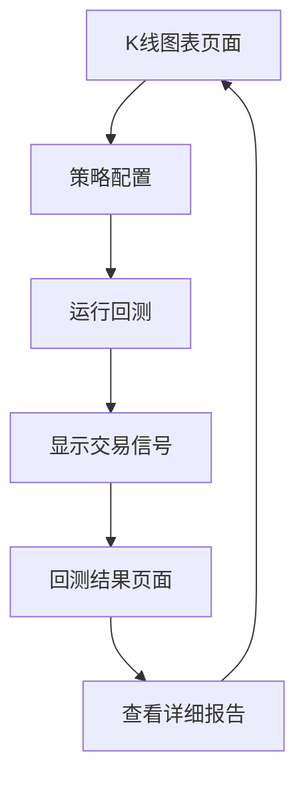

# 量化策略前端重构产品需求文档

## 1. 产品概述

本项目旨在重构量化策略回测系统的前端应用，提供专业的K线图表展示和策略回测功能。系统基于H5历史数据文件，支持对冲网格策略的可视化回测，为量化交易者提供直观的策略分析工具。

目标是打造一个高性能、易用的量化策略回测平台，帮助用户快速验证和优化交易策略。

## 2. 核心功能

### 2.1 用户角色

| 角色 | 注册方式 | 核心权限 |
|------|----------|----------|
| 量化交易者 | 直接访问 | 可查看K线数据、配置策略参数、运行回测、查看结果 |

### 2.2 功能模块

我们的量化策略前端应用包含以下主要页面：

1. **K线图表页面**：历史K线数据展示、策略回测配置区域、交易信号标记
2. **回测结果页面**：回测数据展示、收益曲线图、交易历史记录

### 2.3 页面详情

| 页面名称 | 模块名称 | 功能描述 |
|----------|----------|----------|
| K线图表页面 | K线图表组件 | 基于H5文件数据渲染专业K线图，支持缩放、平移、时间范围选择 |
| K线图表页面 | 策略配置面板 | 选择对冲网格策略，配置网格间距、初始资金、手续费等参数 |
| K线图表页面 | 回测控制区 | 启动回测按钮、进度显示、实时状态更新 |
| K线图表页面 | 交易信号标记 | 在K线图上标记开多、开空、平多、平空位置，不同颜色区分 |
| 回测结果页面 | 回测概览 | 显示总收益率、夏普比率、最大回撤、胜率等关键指标 |
| 回测结果页面 | 收益曲线图 | 绘制资金曲线、回撤曲线的时间序列图表 |
| 回测结果页面 | 交易记录表 | 展示每笔交易的开仓时间、平仓时间、收益、持仓时长等详细信息 |
| 回测结果页面 | 持仓历史图 | 可视化展示持仓变化历史，包括多空仓位的时间分布 |

## 3. 核心流程

**主要用户操作流程：**

1. 用户访问K线图表页面，系统自动加载H5文件中的历史K线数据
2. 用户在策略配置面板中选择对冲网格策略，设置相关参数
3. 用户点击运行回测按钮，系统调用后端API执行策略回测
4. 回测完成后，K线图上显示交易信号标记
5. 用户可跳转到回测结果页面查看详细的回测报告和分析

## 4. 用户界面设计

### 4.1 设计风格

- **主色调**：深色主题 (#1a1a1a 背景，#2d2d2d 面板)，绿色 (#00c851) 表示上涨，红色 (#ff4444) 表示下跌
- **按钮样式**：圆角按钮，悬停效果，主要按钮使用蓝色 (#2196f3)
- **字体**：Roboto, 'Microsoft YaHei', sans-serif，主要文字 14px，标题 16-20px
- **布局风格**：卡片式布局，顶部导航栏，左右分栏设计
- **图标风格**：Material Design 图标，简洁现代

### 4.2 页面设计概览

| 页面名称 | 模块名称 | UI元素 |
|----------|----------|--------|
| K线图表页面 | K线图表组件 | 全屏K线图，深色背景，绿红蜡烛图，成交量柱状图，时间轴缩放控件 |
| K线图表页面 | 策略配置面板 | 右侧固定面板，卡片式布局，表单控件，参数输入框，下拉选择器 |
| K线图表页面 | 交易信号标记 | 图表上的箭头标记，开多(绿色向上)，开空(红色向下)，平仓(黄色圆点) |
| 回测结果页面 | 回测概览 | 顶部指标卡片，数值高亮显示，正负收益不同颜色 |
| 回测结果页面 | 收益曲线图 | 双Y轴折线图，资金曲线(蓝色)，回撤曲线(红色)，网格背景 |
| 回测结果页面 | 交易记录表 | 分页表格，排序功能，盈亏着色，时间格式化显示 |

### 4.3 响应式设计

桌面优先设计，支持移动端适配。在移动设备上，策略配置面板改为底部抽屉式设计，K线图支持触摸缩放和平移操作。