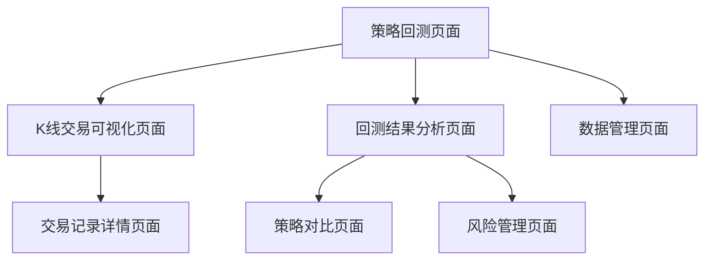
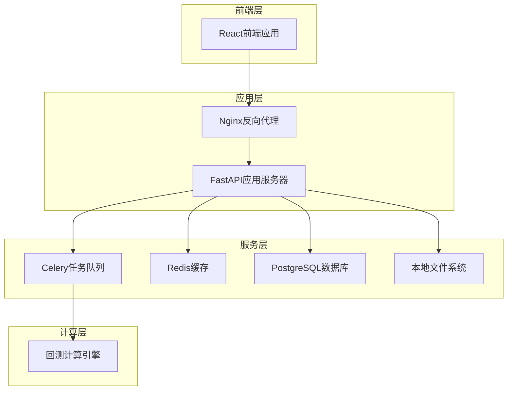
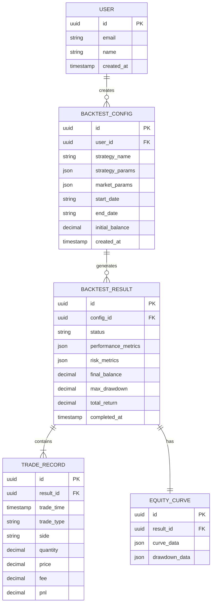

# 量化策略回测可视化网站 - 产品需求文档 (PRD)

## 1. 产品概述

基于现有对冲网格策略量化交易回测系统，构建一个专业的量化策略回测可视化网站，能够在K线图上清晰展现每一笔交易的位置，提供完整的回测分析和策略优化功能。

该产品旨在为量化交易者提供直观、专业的策略回测工具，帮助用户深入分析策略表现，优化交易参数，提升策略收益率。

## 2. 核心特性

### 2.1 用户角色

| 角色    | 注册方式 | 核心权限              |
| ----- | ---- | ----------------- |
| 量化交易者 | 直接访问 | 可进行策略回测、参数调整、结果分析 |
| 策略研究员 | 直接访问 | 可查看详细交易记录、风险指标分析  |

### 2.2 功能模块

我们的量化回测可视化网站包含以下核心页面：

1. **策略回测页面**：参数配置、回测执行、实时进度展示
2. **K线交易可视化页面**：K线图展示、交易标记、价格轨迹分析
3. **回测结果分析页面**：资金曲线、收益统计、风险指标
4. **策略对比页面**：多策略对比分析、参数敏感性测试
5. **交易记录详情页面**：详细交易日志、盈亏分析
6. **风险管理页面**：ATR分析、仓位管理、风控指标
7. **数据管理页面**：K线数据导入、数据预处理状态

### 2.3 页面详情

| 页面名称      | 模块名称     | 功能描述                                   |
| --------- | -------- | -------------------------------------- |
| 策略回测页面    | 参数配置面板   | 配置回测时间范围、初始资金、杠杆倍数、价差参数等核心策略参数         |
| 策略回测页面    | 回测执行控制   | 启动回测、暂停回测、停止回测，显示实时进度和状态               |
| 策略回测页面    | 快速预设模板   | 提供保守型、平衡型、激进型等预设参数组合                   |
| K线交易可视化页面 | 交互式K线图   | 基于TradingView图表库的专业K线展示，支持缩放、平移、时间范围选择 |
| K线交易可视化页面 | 交易标记系统   | 在K线图上标记开仓、平仓、止损等交易事件，不同颜色区分多空方向        |
| K线交易可视化页面 | 价格轨迹分析   | 展示价格在开盘、最高、最低、收盘之间的运动轨迹                |
| K线交易可视化页面 | ATR波动率指标 | 实时显示ATR值变化，标记高波动率时段                    |
| 回测结果分析页面  | 资金曲线图表   | 展示账户权益变化、回撤分析、收益率曲线                    |
| 回测结果分析页面  | 关键指标统计   | 总收益率、最大回撤、夏普比率、胜率、盈亏比等核心指标             |
| 回测结果分析页面  | 月度收益分析   | 按月统计收益表现，识别策略的季节性特征                    |
| 策略对比页面    | 多策略对比    | 同时展示多个参数组合的回测结果，便于参数优化                 |
| 策略对比页面    | 参数敏感性分析  | 分析关键参数对策略表现的影响程度                       |
| 交易记录详情页面  | 交易日志表格   | 详细记录每笔交易的时间、价格、数量、手续费、盈亏等信息            |
| 交易记录详情页面  | 盈亏分布分析   | 统计交易盈亏分布、持仓时间分布等                       |
| 风险管理页面    | ATR监控面板  | 实时监控ATR值变化，展示风控触发历史                    |
| 风险管理页面    | 仓位管理分析   | 分析多空仓位平衡情况，展示仓位调整历史                    |
| 数据管理页面    | 数据导入工具   | 支持K线数据的导入、验证、预处理                       |
| 数据管理页面    | 数据状态监控   | 显示数据完整性、缓存状态、处理进度                      |

## 3. 核心流程

用户首先在策略回测页面配置回测参数，包括时间范围、资金设置、策略参数等。点击开始回测后，系统执行对冲网格策略回测，实时显示进度。

回测完成后，用户可在K线交易可视化页面查看详细的交易执行情况，每笔开仓、平仓都在K线图上清晰标记。同时可切换到回测结果分析页面查看整体表现指标。

对于需要优化策略的用户，可使用策略对比页面进行多参数组合测试，找到最优参数配置。



## 4. 用户界面设计

### 4.1 设计风格

* 主色调：深蓝色 (#1a365d) 和金色 (#f6ad55)，体现专业金融风格

* 按钮样式：圆角矩形，渐变效果，悬停时有阴影动画

* 字体：主要使用 'Microsoft YaHei', 'Roboto'，代码区域使用 'Consolas', 'Monaco'

* 布局风格：卡片式布局，左侧导航栏，顶部工具栏

* 图标风格：使用 Feather Icons 或 Heroicons，简洁线性风格

### 4.2 页面设计概览

| 页面名称      | 模块名称   | UI元素                                        |
| --------- | ------ | ------------------------------------------- |
| 策略回测页面    | 参数配置面板 | 表单控件采用卡片布局，输入框有聚焦动画，滑块控件用于数值调整，颜色编码区分不同参数类型 |
| K线交易可视化页面 | 交互式K线图 | 全屏图表布局，工具栏浮动在图表上方，支持全屏模式，图表背景为深色主题          |
| K线交易可视化页面 | 交易标记系统 | 开多用绿色向上箭头，开空用红色向下箭头，平仓用黄色圆点，标记大小根据交易量调整     |
| 回测结果分析页面  | 资金曲线图表 | 双Y轴图表，左轴显示资金，右轴显示回撤，使用渐变填充区域，关键点有数据标签       |
| 回测结果分析页面  | 关键指标统计 | 指标卡片网格布局，每个指标有图标、数值、变化趋势，正负收益用不同颜色区分        |

### 4.3 响应式设计

采用桌面优先设计，针对1920x1080及以上分辨率优化。支持平板设备适配，图表和表格在小屏幕上可横向滚动。考虑触摸交互优化，按钮和控件有足够的点击区域。

## 5. 技术架构设计

### 5.1 架构选择

**推荐采用前后端分离架构**，原因如下：

1. **专业性要求**：量化交易可视化需要复杂的图表交互和实时数据更新，前端需要专门优化
2. **性能考虑**：回测计算密集，后端需要专门处理，前端专注于展示和交互
3. **扩展性**：未来可能需要支持多种策略、多个交易所，分离架构更易扩展
4. **开发效率**：可以并行开发，前端专注用户体验，后端专注算法优化

### 5.2 技术选型

**前端技术栈：**

* **框架**：React 18 + TypeScript

* **图表库**：TradingView Charting Library（专业金融图表）

* **UI组件库**：Ant Design + Tailwind CSS

* **状态管理**：Zustand（轻量级状态管理）

* **构建工具**：Vite

* **数据请求**：React Query + Axios

**后端技术栈：**

* **框架**：FastAPI（高性能异步框架）

* **数据处理**：pandas + numpy（保持现有优势）

* **缓存**：Redis（回测结果缓存）

* **任务队列**：Celery（长时间回测任务）

* **数据库**：PostgreSQL（存储回测配置和结果）

### 5.3 数据服务

* **Supabase**：用户认证、配置存储、回测结果持久化

* **Redis**：K线数据缓存、回测进度缓存

* **本地文件系统**：原始K线数据存储（.h5文件）

### 5.4 核心API定义

#### 4.1 回测相关API

**启动回测**

```
POST /api/v1/backtest/start
```

请求参数：

| 参数名称             | 参数类型   | 是否必需  | 描述     |
| ---------------- | ------ | ----- | ------ |
| strategy\_config | object | true  | 策略配置参数 |
| backtest\_config | object | true  | 回测配置参数 |
| market\_config   | object | false | 市场配置参数 |

响应：

| 参数名称     | 参数类型   | 描述     |
| -------- | ------ | ------ |
| task\_id | string | 回测任务ID |
| status   | string | 任务状态   |

**获取回测进度**

```
GET /api/v1/backtest/progress/{task_id}
```

响应：

| 参数名称     | 参数类型   | 描述     |
| -------- | ------ | ------ |
| progress | number | 进度百分比  |
| status   | string | 当前状态   |
| eta      | number | 预计剩余时间 |

#### 4.2 K线数据API

**获取K线数据**

```
GET /api/v1/klines
```

请求参数：

| 参数名称        | 参数类型   | 是否必需  | 描述    |
| ----------- | ------ | ----- | ----- |
| symbol      | string | true  | 交易对符号 |
| start\_date | string | true  | 开始日期  |
| end\_date   | string | true  | 结束日期  |
| timeframe   | string | false | 时间周期  |

响应：

| 参数名称   | 参数类型  | 描述     |
| ------ | ----- | ------ |
| klines | array | K线数据数组 |
| trades | array | 交易标记数组 |

#### 4.3 回测结果API

**获取回测结果**

```
GET /api/v1/backtest/result/{task_id}
```

响应：

| 参数名称                 | 参数类型   | 描述     |
| -------------------- | ------ | ------ |
| equity\_curve        | array  | 资金曲线数据 |
| trade\_history       | array  | 交易历史记录 |
| performance\_metrics | object | 绩效指标   |
| risk\_metrics        | object | 风险指标   |

## 6. 服务器架构图



## 7. 数据模型

### 7.1 数据模型定义



### 7.2 数据定义语言

**用户表 (users)**

```sql
CREATE TABLE users (
    id UUID PRIMARY KEY DEFAULT gen_random_uuid(),
    email VARCHAR(255) UNIQUE NOT NULL,
    name VARCHAR(100) NOT NULL,
    created_at TIMESTAMP WITH TIME ZONE DEFAULT NOW()
);

CREATE INDEX idx_users_email ON users(email);
```

**回测配置表 (backtest\_configs)**

```sql
CREATE TABLE backtest_configs (
    id UUID PRIMARY KEY DEFAULT gen_random_uuid(),
    user_id UUID REFERENCES users(id),
    strategy_name VARCHAR(100) NOT NULL,
    strategy_params JSONB NOT NULL,
    market_params JSONB,
    start_date DATE NOT NULL,
    end_date DATE NOT NULL,
    initial_balance DECIMAL(15,2) NOT NULL,
    created_at TIMESTAMP WITH TIME ZONE DEFAULT NOW()
);

CREATE INDEX idx_backtest_configs_user_id ON backtest_configs(user_id);
CREATE INDEX idx_backtest_configs_created_at ON backtest_configs(created_at DESC);
```

**回测结果表 (backtest\_results)**

```sql
CREATE TABLE backtest_results (
    id UUID PRIMARY KEY DEFAULT gen_random_uuid(),
    config_id UUID REFERENCES backtest_configs(id),
    status VARCHAR(20) DEFAULT 'running',
    performance_metrics JSONB,
    risk_metrics JSONB,
    final_balance DECIMAL(15,2),
    max_drawdown DECIMAL(8,4),
    total_return DECIMAL(8,4),
    completed_at TIMESTAMP WITH TIME ZONE
);

CREATE INDEX idx_backtest_results_config_id ON backtest_results(config_id);
CREATE INDEX idx_backtest_results_status ON backtest_results(status);
```

**交易记录表 (trade\_records)**

```sql
CREATE TABLE trade_records (
    id UUID PRIMARY KEY DEFAULT gen_random_uuid(),
    result_id UUID REFERENCES backtest_results(id),
    trade_time TIMESTAMP WITH TIME ZONE NOT NULL,
    trade_type VARCHAR(20) NOT NULL,
    side VARCHAR(10) NOT NULL,
    quantity DECIMAL(18,8) NOT NULL,
    price DECIMAL(15,2) NOT NULL,
    fee DECIMAL(15,8) NOT NULL,
    pnl DECIMAL(15,8)
);

CREATE INDEX idx_trade_records_result_id ON trade_records(result_id);
CREATE INDEX idx_trade_records_trade_time ON trade_records(trade_time);
```

**初始化数据**

```sql
INSERT INTO users (email, name) VALUES 
('demo@example.com', '演示用户');

INSERT INTO backtest_configs (user_id, strategy_name, strategy_params, start_date, end_date, initial_balance)
SELECT 
    u.id,
    '对冲网格策略',
    '{"leverage": 125, "spread": 0.004, "atr_threshold": 0.30}',
    '2020-01-01',
    '2020-05-20',
    1000.00
FROM users u WHERE u.email = 'demo@example.com';
```

