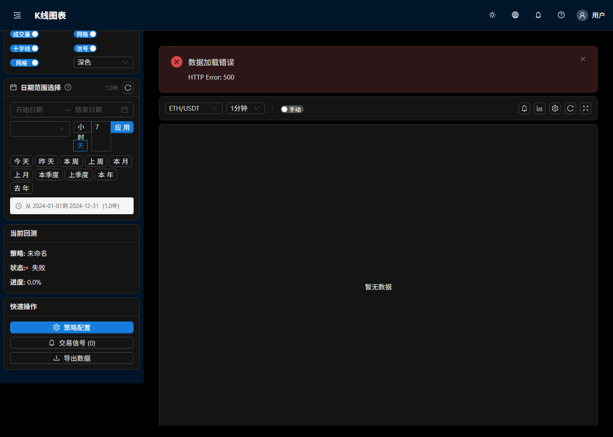

  

# 量智回测平台 · Liangzhi Backtest Platform

一个面向永续合约做市与网格类策略的专业回测平台，融合 React + Vite 前端、Node.js API 与 Python 回测引擎，支持 ATR 自适应网格策略，强调数据完整性与可视化分析体验。

## 中文简介
- 单仓库统一前端与后端：`apps/liangzhi-huice/` 前端与 API；`services/backtest-engine/` Python 回测引擎与数据；`ops/` 运维脚本。
- 数据管理：内置 Git LFS 管理 `.h5`、`.pkl` 等大文件，保证拉取与提交稳定可靠。
- 策略支持：ATR 自适应网格、返佣与成本模型、关键指标（夏普、最大回撤、胜率、盈亏比）。
- 可视化：ECharts K线与权益曲线、信号标记、参数化表单、进度回测。

### 快速开始
- 安装前端依赖：`cd apps/liangzhi-huice && npm install`
- 本地开发模式：`npm run dev`
- 运行回测引擎：`cd services/backtest-engine && python -X utf8 backtest_kline_trajectory.py`
- 环境变量：`H5_FILE_PATH` 可覆盖数据路径；默认指向 `services/backtest-engine`。

## English Overview
Liangzhi Backtest Platform is a professional backtesting system for perpetual market-making and grid strategies. It unifies a React + Vite frontend, a Node.js API, and a Python backtesting engine with ATR adaptive grid support, robust data integrity, and rich visualization.

### Highlights
- Monorepo architecture: `apps/liangzhi-huice/` (frontend & API), `services/backtest-engine/` (Python engine & data), `ops/` (deployment scripts).
- Data integrity: Git LFS for heavy data files (`.h5`, `.pkl`).
- Strategy & metrics: ATR adaptive grid, fee & slippage modeling, key KPIs (Sharpe, Max Drawdown, Win Rate, P/L Ratio).
- Visualization: ECharts-based candlesticks, equity curve, signal markers, parameterized forms.

## 目录结构
- `apps/liangzhi-huice/`：React + Vite 前端与 Express API 服务，含 Supabase 集成与图表组件。
- `services/backtest-engine/`：Python 回测脚本与数据缓存、H5 文件。
- `ops/`：部署与运维脚本（PowerShell、Batch）。
- `.vercel/`：Vercel 本地项目配置，默认根目录为 `apps/liangzhi-huice`。
- 其他历史资料保留（如 `.ai_memory`、`.trae`）。

## 开发与运行
- Node.js 版本：建议 `>=18`
- Python：建议 `>=3.11`，执行：`python -X utf8 script.py`
- 启动前端与 API：
  - `cd apps/liangzhi-huice && npm install`
  - `npm run dev`
- 启动回测引擎：
  - `cd services/backtest-engine`
  - `python -X utf8 backtest_kline_trajectory.py`

## 预览截图

### 权益曲线（来自真实回测结果）

  

### 前端 K 线信号（真实数据与交互）

  

## 许可协议
本项目采用 MIT 许可证，详情见 [`LICENSE`](LICENSE)。

## 致谢与贡献
欢迎通过 Issues 与 Pull Requests 为项目贡献代码、文档与数据工具。请在提交前确保通过基础测试并遵循代码风格与数据完整性规范。
